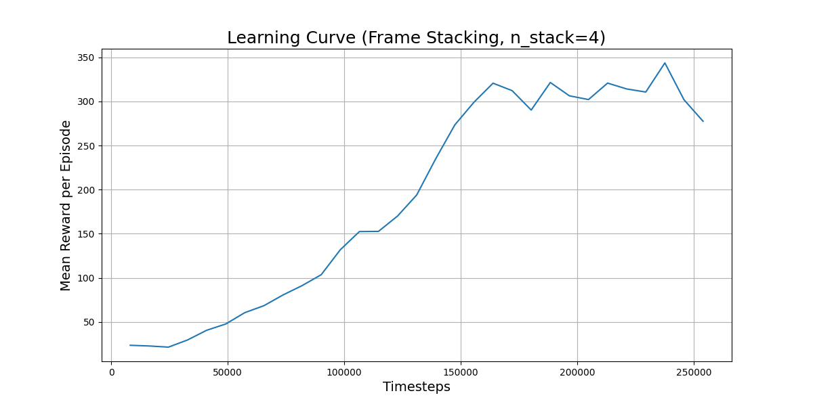
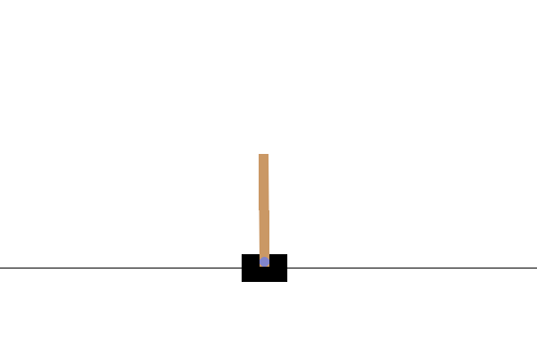

# Deep Reinforcement Learning via Convoultional Neural Netwok and Proximal Policy Optimization for Visual Control of an Inverted Pendulum

## Abstract

This project presents an end-to-end implementation of a Deep Reinforcement Learning (DRL) agent that learns to solve the classic `CartPole-v1` control problem using only raw pixel data from the environment. The primary objective was to engineer a complete DRL pipeline, encompassing environment preprocessing, custom neural network design, methodical hyperparameter tuning, and detailed performance analysis. Through a series of controlled experiments, we demonstrate that while baseline models struggle due to perceptual limitations, an agent augmented with frame stacking can successfully infer environmental dynamics and learn a high-performing control policy, achieving a peak mean reward of 344.

---
## 1. Methodology and System Architecture

The agent's learning process is based on a modular pipeline that transforms raw visual input into proficient control actions. The key components are detailed below.

### 1.1. Visual Preprocessing
The environment's raw `(400, 600, 3)` RGB render is too high-dimensional for efficient training. A preprocessing pipeline using **OpenCV** was developed to:
1.  **Crop** the image to the region of interest.
2.  Convert the image to **grayscale**.
3.  **Resize** the image to a standard `(84, 84, 1)` format.

### 1.2. System Architecture
The data flows from the environment through a series of wrappers and learning components. The policy network, which maps observations to actions, uses a custom Convolutional Neural Network (CNN) built in **PyTorch** as its feature extractor.

*(Placeholder for your architecture diagram)*

### 1.3. Learning Algorithm
The **Proximal Policy Optimization (PPO)** algorithm from **Stable Baselines3** was used for training. PPO is a state-of-the-art, on-policy algorithm known for its stability and reliable performance across a wide range of tasks.

---
## 2. Experimentation and Results

A series of controlled experiments were conducted to identify the key factors for achieving high performance. The "Frame Stacking" experiment proved to be the critical breakthrough.

| Exp. ID | Hypothesis | Final Mean Reward | Analysis |
| :--- | :--- | :--- | :--- |
| **0** | **Baseline Model** | ~50 | The agent learned a basic policy but quickly plateaued. |
| **1**| A **Lower Learning Rate** will improve stability | ~50 | Performance was similar to the baseline. |
| **2**| A **Wider CNN** to potentially extract better features| ~50 | No significant improvement and much slower training. |
| **3**| **Frame Stacking** will provide dynamics information | **344** | **Major breakthrough.** The agent successfully broke the plateau. |

### 2.1. Learning Curve Analysis
The learning curve for the final, successful agent (Experiment 3) demonstrates a clear and sustained improvement in performance, validating the effectiveness of frame stacking.

### 2.2. Qualitative Performance Comparison
The final trained agent's performance is compared against a baseline agent taking random actions. Both start from the identical initial state (`seed=32`).

| Agent Type | Final Reward | Visual Performance |
| :--- | :--- | :--- |
| **Random Agent** | 20.0 |  |
| **Trained Agent** | 500 |  |

---
## 3. Conclusion and Future Work

The experiments definitively show that for this visual control problem, the most critical factor for success was providing the agent with **temporal information** representing the dynamic nature of the problem in hand. A simple agent, regardless of architecture or learning rate, was "state-blind" and could not develop a proactive policy. By stacking four consecutive frames, the agent was able to infer the system's dynamics

---
## 4. Skills and Technologies Showcase

This project demands a comprehensive repertoire in machine learning engineering and reinforcement learning.

* **Reinforcement Learning:**
    * **Theory:** Policy Gradients (PPO), Actor-Critic Methods, Discount Factor (Gamma), On-policy learning.
    * **Implementation:** Stable Baselines3 for robust algorithm implementation.

* **Deep Learning:**
    * **Theory:** Convolutional Neural Networks (CNNs), Backpropagation, Hyperparameter Tuning, Batch Normalization.
    * **Implementation:** PyTorch for custom neural network design (`nn.Module`, `nn.Conv2d`).

* **Computer Vision:**
    * **Implementation:** **OpenCV** for image manipulation (cropping, color conversion, resizing).

* **Software Engineering:**
    * **Environment:** Python, Jupyter Notebooks, Google Colab (with GPU).
    * **Libraries:** NumPy, Pandas, Matplotlib, PyTorch, Gymnasium, imageio, stable baseline3.
    * **Best Practices:** Modular code, Experiment Tracking, Version Control (Git/GitHub), Documentation (`README.md`).

---
## 5. Repository Structure

-   **/notebooks**: Contains the Jupyter notebooks for each project phase.
-   **/utils**: Contains modular helper code for environment preprocessing.
-   **/media**: Stores output GIFs and graphs.
-   **/models** & **/logs**: Store training artifacts (Tracked by `.gitignore`).