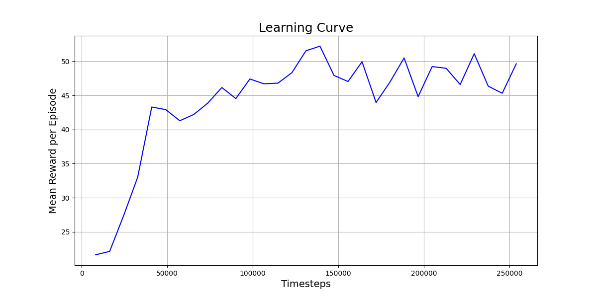
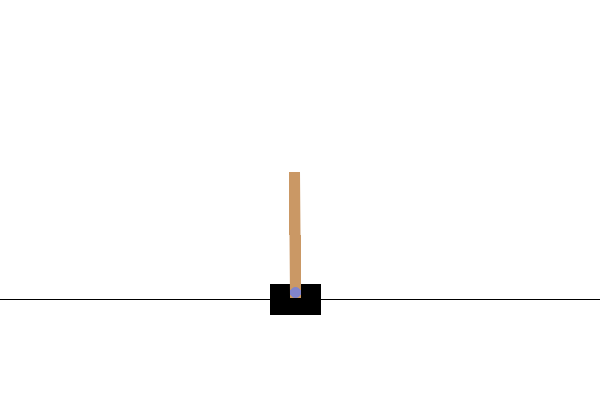

# Visual CartPole RL

This project showcases a Deep Reinforcement Learning agent trained to solve the `CartPole-v1` environment from Gymnasium using only visual input. The goal is to demonstrate a complete workflow from environment preprocessing and custom model building to training, evaluation, and analysis.

### Core Technologies
* **Gymnasium:** For the simulation environment.
* **PyTorch:** For building the custom CNN policy.
* **OpenCV:** For image preprocessing.
* **Stable Baselines3:** For implementing the RL algorithm.

---
## Results and Analysis

### Learning Curve
The agent was trained for over 250,000 timesteps. The learning curve below shows the mean reward per episode over the course of training. The agent shows clear signs of learning as the reward trends upwards, but its performance eventually plateaus. This indicates that further hyperparameter tuning would be required to achieve a perfect score.

### Performance Comparison
A direct comparison was made between the final trained agent and a baseline agent taking random actions. Both agents were started from the exact same initial state (seed=32).

| Agent Type | Final Reward | Visual Performance |
| :--- | :--- | :--- |
| **Random Agent** | 20.0 |  |
| **Trained Agent** | 66.0 |  |

The visual and quantitative results are clear. The **random agent** fails almost immediately, while the **trained agent** demonstrates a clear, learned policy that successfully balances the pole for a short period. This confirms that the training process was successful in teaching the agent a control strategy from pixels alone.

---
## Project Status & Progress

### Phase 1: Environment and Preprocessing (✅ Complete)
* **Objective:** Transform the standard `CartPole-v1` environment into one that uses screen pixels as its state.
* **Outcome:** A fully functional, wrapped Gymnasium environment ready for visual-based training, with helper code modularized in the `/utils` directory.

### Phase 2: Model Building and Training (✅ Complete)
* **Objective:** Define a custom CNN and train a PPO agent to solve the visual CartPole task.
* **Outcome:** A trained model (`ppo_visual_cartpole_250k.zip`) saved and ready for evaluation.

### Phase 3: Evaluation and Visualization (✅ Complete)
* **Objective:** Qualitatively and quantitatively evaluate the trained agent's performance.
* **Outcome:** A detailed analysis notebook that includes performance GIFs, state-value debugging, and a plotted learning curve.

---
## Repository Structure

-   **/notebooks**: Contains the Jupyter notebooks for each phase.
-   **/utils**: Contains modular helper code for environment preprocessing and model definition.
-   **/media**: Stores output GIFs and graphs.
-   **/models**: Stores trained agent models (Tracked by `.gitignore`).
-   **/logs**: Stores training logs (Tracked by `.gitignore`).